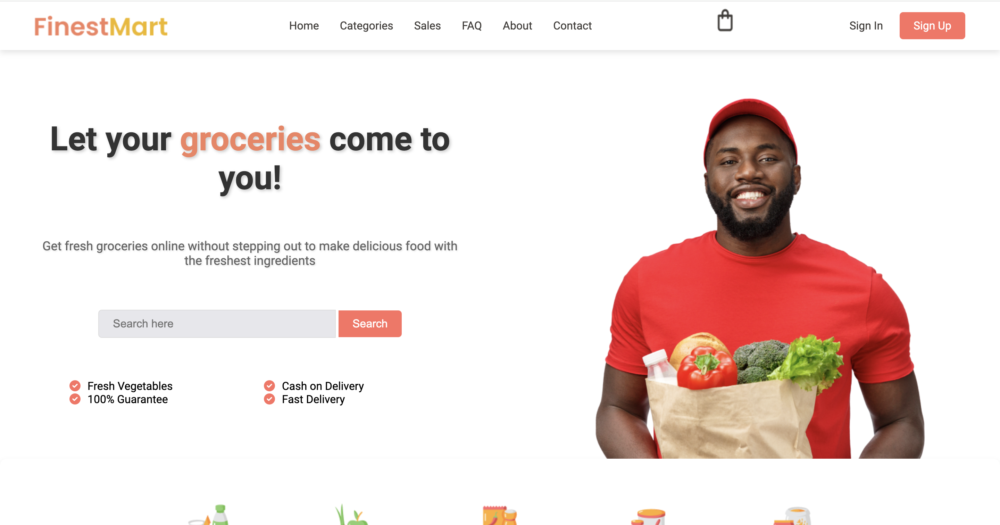

# Grocery Store Landing Page

Welcome to the Grocery Store Landing Page project! This is a simple static webpage created using HTML and CSS. The webpage is designed for desktop use and is not responsive.

You can check out the live version of the site [here](https://quinterodev.github.io/landingGroceryStore/).

## Table of Contents

- [Description](#description)
- [Features](#features)
- [Technologies Used](#technologies-used)
- [Installation](#installation)
- [Usage](#usage)
- [Contributing](#contributing)
- [License](#license)

## Description

This project showcases a landing page for a grocery store. It includes various sections such as a header, featured products, special offers, and contact information.

## Features

- **Header:** Includes the store name and navigation links.
- **Featured Products:** Highlights some of the popular products available in the store.
- **Special Offers:** Displays current promotions and discounts.
- **Contact Information:** Provides details on how to get in touch with the store.

## Technologies Used

- **HTML:** The structure of the webpage.
- **CSS:** The styling of the webpage.

## Installation

To run this project locally:

1. Clone the repository:
   ```sh
   git clone https://github.com/quinterodev/landingGroceryStore.git
   ```

2.	Navigate to the project directory:
   ```sh
   git clone https://github.com/quinterodev/landingGroceryStore.git
   ```

## Usage

Open the `index.html` file in your web browser to view the landing page.

## Contributing

Contributions are welcome! Please fork this repository and submit a pull request for any improvements or bug fixes.

## License

This project is licensed under the MIT License. See the [LICENSE](./LICENSE) file for more details.

