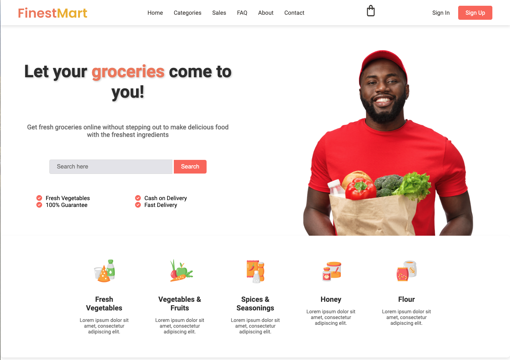

# FinestMart Landing Page

## Description

FinestMart is a static landing page designed for an online grocery store. The page is built with HTML and CSS, featuring a modern and clean design, ideal for attracting customers and offering them a simple and pleasant online shopping experience.

## Features

- **Responsive Design**: The page adapts to different screen sizes, providing an optimal experience on both mobile devices and desktop computers.
- **Grid Layout**: A grid layout is used to distribute elements in an orderly and visually appealing manner.
- **Highlighted Features**: Key features of the store, such as fast delivery and fresh products, are prominently displayed.
- **Background Shadow**: The features section includes a shadowed background to visually highlight the elements.

## Technologies Used

- **HTML5**: For the structure of the page.
- **CSS3**: For styling and visual designs.

## How to Use

	1.	Clone the repository to your local machine.
	2.	Open the index.html file in your browser to view the page.

git clone https://github.com/your-username/your-repository.git
cd your-repository
open index.html

## Contributions

Contributions are welcome. Please open an issue to discuss any major changes before submitting a pull request.
